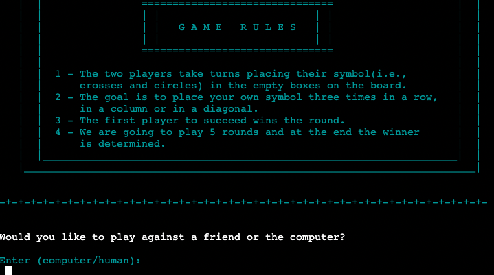
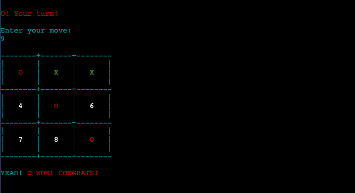

# Tic Tac Toe - Game

# Introduction

Tic Tac Toe is a game built as Portfolio Project 3 for Code Institute Full-stack development course. It utilises pure Python3 and a collection of libraries to expand on the functionality of the project. The game runs in the Code Institute mock terminal on Heroku. The main goal of the game is to place three of the marks in a horizontal, vertical or diagonal row.

[Live Project Here](https://tic-tac-toe-p3.herokuapp.com/)

## README Table Content

- [Introduction](#introduction)
- [User Experience](#ux)
  - [User Stories](#user-stories)
  - [Developer Goals](#goals)
- [Design](#design)
  - [Colours](#colours)
- [Logic](#Logic)
  - [Flowchart](#flowchart)
- [Features](#features)
  - [Logo and Menu](#logo-menu)
  - [Leaderboard](#leaderboard)
  - [Game Rules](#rules)
  - [Choose to play against computer/friend](#computer-friend)
  - [First Player](#first-player)
  - [Game Move](#game-move)
  - [Round Win/Tie](#round-win)
  - [Score](#score)
  - [Game Over](#game-over)
  - [Updated Leaderboard](#updated-leaderboard)
- [Storage Data](#storage)

## <a name="ux">User Experience</a>

---

### <a name="user-stories">User Stories</a>

- As a user, I want to understand the purpose of the game.
- As a user, I want to be able to play the game either against a friend or the computer.
- As a user, I want to be able follow the score after each round.
- As a user, I want to be able to store my result and see other players' results on the Leaderboard.

### <a name="goals">Developer Goals</a>

- As a developer, I want to build an easy game for the user to play.
- As a developer, I want usernames, final scores and date to be uploaded to Google Spreadsheets.
- As a developer, I want the user to be warned if they input invalid data or provide an incorrect answer.

## <a name="design">Design</a>

---

### <a name="colours">Colours</a>

- The colours in the game are supplied by the Python Colorama Model

## <a name="logic">Logic</a>

---

### <a name="flowchart">Flowchart</a>

## <a name="features">Features</a>

---

### <a name="logo-menu">Logo and Menu</a>

When the user enters the website, they see the logo of the game. The user is asked if they want to see the leaderboard or start the game. 

### <a name="leaderboard">Leaderboard</a>

When the user decides to see the leaderboard, the top 15 scores are displayed. After that the user will be asked again if they want to play the game or end it. 

### <a name="rules">Game Rules</a>

When the user decides to play the game, the first thing they see is the rules for playing the game.

### <a name="computer-friend">Choose to play against computer/friend</a>

The user has the option to play the game against the computer. The computer will then make random moves. Alternatively, the user can play against a friend.

### <a name="first-player">First Player</a>

The user is shown who is playing which symbol and a random first player for the first move is generated. 

### <a name="game-move">Game Move</a>

The players are asked in turn to enter their move and it is placed on the field. 

### <a name="round-win">Round Win</a>

When a player has won the round, this is displayed. Also a draw will be shown after there is no move left.

### <a name="round-win">Round Win</a>

After a round is finished, the score is updated and displayed. After that a new round starts.

### <a name="game-over">Game Over</a>

After 5 rounds are played, the game ends, displays the score and the winner. The winner can then save his score in the leaderboard.

### <a name="updated-leaderboard">Updated Leaderboard</a>

After the winner has entered his name the leaderboard will be updated and the best 15 players will be listed.