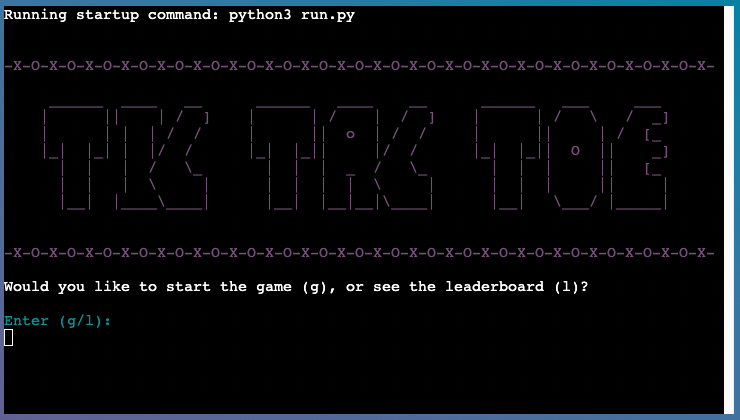

# Tic Tac Toe - Game

# Introduction

Tic Tac Toe is a game built as Portfolio Project 3 for Code Institute Full-stack development course. It utilises pure Python3 and a collection of libraries to expand on the functionality of the project. The game runs in the Code Institute mock terminal on Heroku. The main goal of the game is to place three of the marks in a horizontal, vertical or diagonal row.

# Live Project

[View live project here](https://tic-tac-toe-p3.herokuapp.com/)

## README Table Content

---

- [Introduction](#introduction)
- [User Experience](#ux)
  - [User Stories](#user-stories)
  - [Developer Goals](#goals)
- [Design](#design)
  - [Colours](#colours)
- [Logic](#Logic)
  - [Flowchart](#flowchart)
- [Features](#features)
  - [Logo and Menu](#logo-menu)
  - [Leaderboard](#leaderboard)
  - [Game Rules](#rules)
  - [Choose to play against computer/friend](#computer-friend)
  - [First Player](#first-player)
  - [Game Move](#game-move)
  - [Round Win/Tie](#round-win)
  - [Score](#score)
  - [Game Over](#game-over)
  - [Updated Leaderboard](#updated-leaderboard)
  - [Future Features](#future-features)
- [Storage Data](#storage)
  - [Creating Sheets](#creating-sheets)
  - [API Credentials](#api-credentials)
- [Technologies Used](#technologies)
  - [Languages Used](#languages)
  - [Python Packages](#python-Packages)
  - [Frameworks - Libraries - Programs Used](#frameworks-libraries-programs)
- [Testing](#testing)
  - [Functional Testing](#functional-testing)
  - [Validator Testing](#validator-testing)
  - [User Experience Testing](#ux-testing)
  - [Bugs](#bugs)
- [Deployment](#deployment)
  - [Local Deployment](#local-deployment)
  - [Heroku Deployment](#heroku-deployment)
- [References & Credit](#references-credit)

## <a name="ux">User Experience</a>

---

### <a name="user-stories">User Stories</a>

- As a user, I want to understand the purpose of the game.
- As a user, I want to be able to play the game either against a friend or the computer.
- As a user, I want to be able follow the score after each round.
- As a user, I want to be able to store my result and see other players' results on the Leaderboard.

### <a name="goals">Developer Goals</a>

- As a developer, I want to build an easy game for the user to play.
- As a developer, I want usernames, final scores and date to be uploaded to Google Spreadsheets.
- As a developer, I want the user to be warned if they input invalid data or provide an incorrect answer.

## <a name="design">Design</a>

---

### <a name="colours">Colours</a>

- The colours in the game are supplied by the Python Colorama package. The package has allowed a few colours to be applied to the text within the terminal environment.

## <a name="logic">Logic</a>

---

### <a name="flowchart">Flowchart</a>

## <a name="features">Features</a>

---

### <a name="logo-menu">Logo and Menu</a>

When the user enters the website, they see the logo of the game. The user is asked if they want to see the leaderboard or start the game. 

### <a name="leaderboard">Leaderboard</a>

When the user decides to see the leaderboard, the top 15 scores are displayed. After that the user will be asked again if they want to play the game or end it. 

### <a name="rules">Game Rules</a>

When the user decides to play the game, the first thing they see is the rules for playing the game.

### <a name="computer-friend">Choose to play against computer/friend</a>

The user has the option to play the game against the computer. The computer will then make random moves. Alternatively, the user can play against a friend.

### <a name="first-player">First Player</a>

The user is shown who is playing which symbol and a random first player for the first move is generated. 

### <a name="game-move">Game Move</a>

The players are asked in turn to enter their move and it is placed on the field. 

### <a name="round-win">Round Win</a>

When a player has won the round, this is displayed. Also a draw will be shown after there is no move left.

### <a name="round-win">Round Win</a>

After a round is finished, the score is updated and displayed. After that a new round starts.

### <a name="game-over">Game Over</a>

After 5 rounds are played, the game ends, displays the score and the winner. The winner can then save his score in the leaderboard.

### <a name="updated-leaderboard">Updated Leaderboard</a>

After the winner has entered his name the leaderboard will be updated and the best 15 players will be listed.

### <a name="future-features">Future Features</a>

#### Smarter Computers moves:

I would like to improve the computer's random moves. First the computer should choose a move that leads to a win. If no move is currently leading to a win, then the computer should choose a move that blocks the user's win. If there is no move to be blocked, the computer should make a random move. 

#### Advanced version of the game:

To make the game a bit more challenging, I would like to include mathematics. The player must not only have three symbols in a row, column or diagonally. Instead of the symbols, the player can use numbers from 1-9. The numbers of a player in a row, column or diagonal must then sum up 15. 

## <a name="storage">Storage Data</a>

---

I have used a Google sheet to save the player name, score and date. The sheet is connected to the code through the Google Drive and the Google Sheet API by the Google Cloud Platform. This enables me to send and receive data as I had access to the Google Sheet API credentials. When deploying the project to Heroku, I added in the Config Vars to the credentials. As this is sensitive data, I also had to add the creds.json in the Git ignore file. This would ensure that these credentials are not pushed to the repository.

### Creating Sheets

- Navigate to [Google Sheets](https://docs.google.com/spreadsheets/u/0/).
- Create a Blank sheet.  
- Edit the sheet name.
- The name used must match the name called in the `open()` method.
- Input data if required.
- The `gspread` package allows many operations including retrieving, updating
  and adding new data.

### API Credentials

To enable access from the project to Google Sheets, credentials must be created and provided.

- Navigate to the [Google Cloud Platform](https://console.cloud.google.com/)
- Click "Select a project"
- Click "New Project".
- Enter the project name.
- Click "Create"
- From the project dashboard, select "APIs and services" and then "Library"
- Search for Google Drive API and enable it.
- Click "Create Credentials".-
- Select "Google Drive API" from the drop down list.
- Select "Application data" from the first set of radio buttons.
- Select "No, I', not using them" from the second set of radio buttons.
- Click "Done" and afterwards enter name and describtion for the service account details.
- Select a role of "Editor" from the options available.
- Click "Done" to create the service account.
- Click on the newly created service account on the credentials page.
- Select "Keys" from the top menu bar.
- Select "Create new key" from the "Add Key" menu.
- Select "JSON" and click "Create"
- The JSON file will be downloaded to your computer. Copy the contents into a creds.json file within the repository. Make sure to add this file to the .gitignore file as this is sensitive data. 

## <a name="technologies">Technologies Used</a>

---

### <a name="languages">Languages Used</a>

- [Python](https://www.python.org/)

### <a name="python-packages">Python Packages</a>

- [Random](https://docs.python.org/3/library/random.html?highlight=random#module-random): returns a random integer to get a random move for the computer player and returns a random choice to determin the first player.
- [Sys](https://docs.python.org/3/library/sys.html), [Sleep], [Time](https://docs.python.org/3/library/time.html): used to create a typing effect.
- [Datetime](https://docs.python.org/3/library/datetime.html): used to return the full date
- [Gspread](https://pypi.org/project/gspread/): allows communication with Google Sheets
- [Colorama](https://pypi.org/project/colorama/): allows terminal text to be printed in different colours
- [google.oauth2.service_accoun](https://google-auth.readthedocs.io/en/stable/index.html): credentials used to validate credentials and grant access to Google service accounts

### <a name="frameworks-libraries-programs">Frameworks - Libraries - Programs Used</a>

- [GitHub](https://github.com/) was used for version control and site deployment.
- [Gitpod](https://gitpod.io/) is the Integrated Development Environment (IDE) chosen for this project.
- [Google Cloud](https://cloud.google.com/) was use for accessing a library of Google-based API services.
- [Google Drive API](https://developers.google.com/drive/api/guides/) was used for communicating with a cloud service to upload data.
- [Google Sheets API](https://developers.google.com/sheets/api/guides/concepts) was use for reading and writing automated data to a cloud-hosted spreadsheet file.
- [Heroku](https://id.heroku.com) was used to deploy the live project
- [PEP8](http://pep8online.com/) was used to validate all the Python code
- [Patorjk](https://patorjk.com) was used to create the game logos
- [Lucidchart](https://lucid.app/) was used to create the flowchart

### <a name="testing">Testing</a>

---

### <a name="functional-testings">Functional Testing</a>

| Test                                                                                           | Completed successfully |
| :--------------------------------------------------------------------------------------------- | :--------------------: |
| Tic tac toe logo displayed                                                                     |          Yes           |
| The user is asked if they want to see the leaderboard or play the game                         |          Yes           |
| Can the user enter the selection options in upper as well as lower case?                       |          Yes           |
| The user will be asked to re-enter his selection if it was not in the listed choices           |          Yes           |
| The user is asked if they want to play against a computer or a friend                          |          Yes           |
| A random first player is generated                                                             |          Yes           |
| If the user plays against the computer random moves are generated                              |          Yes           |
| Players can enter their moves in alternation                                                   |          Yes           |
| If a field is already occupied, the user will be asked again to enter a move.                  |          Yes           |
| Once a player has won, it is recognized and the round is over.                                 |          Yes           |
| When no more moves are left a draw is indicated and the round ends                             |          Yes           |
| The scores of the players will be updated after the round is finished                          |          Yes           |
| The board is reset and a new round is started                                                  |          Yes           |
| After 5 rounds the game ends                                                                   |          Yes           |
| After finishing the game, if the player has played against the computer, he can save his score |          Yes           |
| If two human players have played against each other the winner can save his score              |          Yes           |
| If the game ends in a draw only the leaderboard will be displayed                              |          Yes           |
| After entering the user, the leaderboard is updated and the top 15 scores are displayed.       |          Yes           |

### <a name="validator-testing">Validator Testing</a>

### PEP 8 Online

The [PEP8](https://pep8ci.herokuapp.com/) Validator Service was used to validate every Python file in the project to ensure there were no syntax errors in the project.

- No errors or warnings were found during the testing of the code in PEP8

run.py

game_art.py

game_extras.py

---

### W3C Markup Validator

No errors or warnings were found during testing of the code in [W3C Markup Validator](https://validator.w3.org/).

HTML Validator Result

---

### W3C CSS Validator

No errors or warnings were found during testing of the code in [W3C CSS Validator](https://jigsaw.w3.org/css-validator/).

CSS Validator Result

---

### JSHint JS Validator

The [JSHint JS Validator](https://jshint.com/) return three warnings. Since JS was not part of this project and the code was from the utilized template, the warnings remained unedited.

JSHint JS Validator Result]

---

### Lighthouse

Lighthouse Desktop Validator Results - Desktop

Lighthouse Desktop Validator Results - Mobile

---

### <a name="ux-testing">User Experience Testing</a>

#### User Stories

- As a user, I want to understand the purpose of the game.

  _This was achieved by displaying the rules at the beginning of the game._

- As a user, I want to be able to play the game either against a friend or the computer.

  _At the beginning of the game the user has the option to play against the computer or against a friend._

- As a user, I want to be able follow the score after each round.

  _After the end of each round, the updated score is displayed to the user._

- As a user, I want to be able to store my result and see other players' results on the Leaderboard.

  _This was achieved through the API connection with Google Sheets, in which the winner can save their score and the top 15 score is displayed._

#### Site Owner Goals

- As a developer, I want to build an easy game for the user to play.

  _The game is familiar to all the people of the world since childhood and the user is guided throughout the game confidently._

- As a developer, I want usernames, final scores and date to be uploaded to Google Spreadsheets.

  _This was achieved through the API connection with Google Sheets, in which the winner can save their score and the top 15 score is displayed._

- As a developer, I want the user to be warned if they input invalid data or provide an incorrect answer.

  _All inputs are validated and if the input does not match the selection options, the user is asked to re-enter the input._

### <a name="Bugs">Bugs</a>

### Fixed Bugs

- Multiple calls for game_over function:

  The way the code was originally structured, the `game_over` function was called multiple times, which resulted in the user being asked to enter his name multiple times to save the final score. I changed the reset_game function and added an if statement which checks if the five rounds have been completed and then calls the `game_over` function.

- Styling Heroku:

  I tried to change the appearance of the Heroku app with CSS to display the terminal centrally. Therefore I wrapped the body in a Div and used flexbox, which in the end disrupted the entire styling. After taking a closer look at the class selector, I could determine that by using `margin: 0 auto` on `xterm-screen` and `xterm-viewport` the terminal could be centralized.

### Unsolved Bugs

- Clear Termin:

In Gitpod my function to clear the terminal had worked wonderfully where in Heroku only the latest lines were cleared. I have tried several [variations](https://github.com/kerstin-w/tic-tac-toe/commit/ab5b63b36911f9a1cf5b1880819cc001690b3363) (found on [GeeksForGeeks](https://www.geeksforgeeks.org/clear-screen-python/) and [DelfStack](https://www.delftstack.com/howto/python/python-clear-console/#use-the-os-module-to-clear-interpreter-console-in-python)) of this function. 
I removed the function from the `class Board` into `game_extras.py` as I thought it might be a problem that this function was called in the class. 
Then I deleted the function and accessed `os.system('clear')` directly. I thought according to the KISS principle, calling another function is taking alonger way and this might be the solution.
Unfortunately, none of my efforts led to the desired result. Since this is not an essential feature, I decided to remove this function, if it does not work 100% well.

## <a name="deployment">Deployment</a>

---

This application has been deployed by using the Heroku cloud platform.
You can find a [template](https://github.com/Code-Institute-Org/python-essentials-template) prepared by Code Institute that is designed to display this application in a modern web browser. This allows the project to be accessible for users without the need of any third party software other than an Internet browser application.

### <a name="local-deplyoment">Local Deployment</a>

Gitpod IDE is the development environment for this project.

Heroku will need the requirements file to deploy the project succesfully.

- To create the project's requirements use: `pip3 freeze > requirements.txt`.
- Afterwards push latest code to Github.

#### Clone this project by following the steps:

1. Navigate to the main page of the repository on GitHub.com.
2. Click Code above the list of files.
3. You will be provided with three options to choose from, HTTPS, SSH, or GitHub CLI
4. Click the clipboard icon in order to copy the URL
5. Open the terminal
6. Change the current working directory to the location where you want the cloned directory
7. Type git clone, and then paste the URL you copied in step 4

### <a name="heroku-deplyoment">Heroku Deployment</a>

This project uses the services available at [Heroku] (https://www.heroku.com). Heroku is a Platform as a Service (PaaS) that allows users to create, deploy, and control applications in a cloud environment.

1. Select "New" in the top-right corner in the Heroku Dashboard after log-in.
2. Select the "Create new app" button from the dropdown menu.
3. Assign a unique name to your application.
4. Next select your region
5. Click on the "Create App" button
6. Navigate to the created application and click on "Settings" Tab.
7. Click "Reveal Config Vars".
8. Enter `PORT` into the Key box and `8000` into the Value box and click the Add button.
9. Next enter `CREDS` into the Key box and credentials (ie. from `creds.json`) into the Value box.
10. Scroll down to the Buildpack section click Add Buildpack select python and click Save Changes.
11. From the same menu select Node.js and click Save Changes.
12. Naviaget to the "Deploy" tab and select the desired deployment method.
13. Select "Enable Automatic Deploy" to rebuild your project automatically every time you push a new commit.
14. Select "Manual Deployment" to manually deploy from your desired branch on will.

## <a name="#references-credit">References & Credit</a>

---

- [Stack Overflow](https://stackoverflow.com/)
  - [Typewriter Effect](https://stackoverflow.com/questions/60608275/how-can-i-print-text-so-it-looks-like-its-being-typed-out) Assistance for the Typewriter effect was found here.
  - [Sleep Effect](https://stackoverflow.com/questions/17432478/python-print-to-one-line-with-time-delay-between-prints) Assistance for the Sleep effect was found here.
  - [Using Set](https://stackoverflow.com/questions/39922967/python-determine-tic-tac-toe-winner) Here I found the idea to use Set to check if someone has won on the grid. 
  - [Format String](https://stackoverflow.com/questions/9989334/create-nice-column-output-in-python) Helped me to improve the formatting of the leaderboard.
- [Using Set](https://www.geeksforgeeks.org/sets-in-python/) Helped to better understand the functionality of set
- [Colorama](https://linuxhint.com/colorama-python/) This source assisted me to implement colorama and provided me with information about the features of colorama.
- [Classes in Python](https://www.programiz.com/python-programming/class) This source gave me a good understanding on using classes in python.